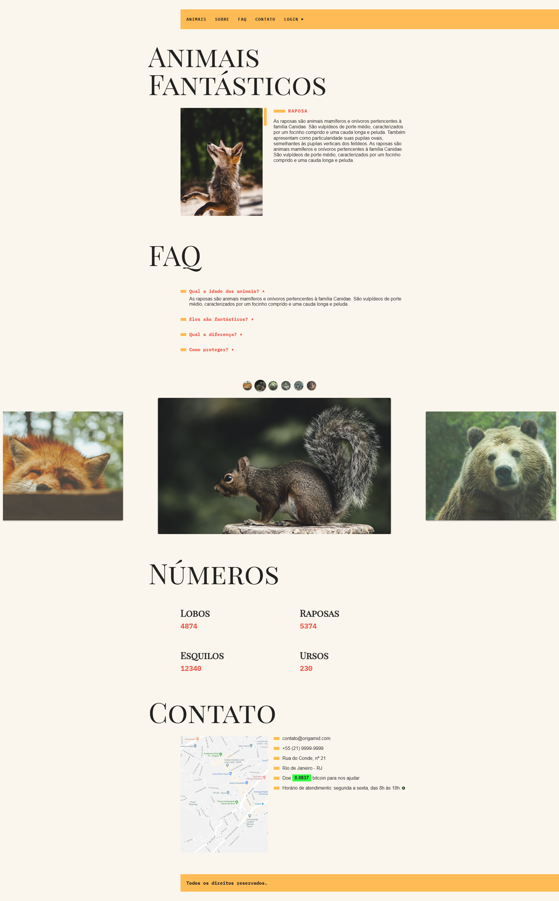

# 🐾 Animais Fantásticos – Projeto Final do Curso Origamid

Este é o projeto desenvolvido como parte do curso **[JavaScript Completo ES6](https://www.origamid.com/curso/javascript-completo-es6/)** da Origamid.
O objetivo do “Animais Fantásticos” é implementar uma aplicação interativa em JavaScript puro, utilizando os conceitos modernos (ES6+), manipulação de DOM, consumo de API externa, classes, módulos, Git, ESLint, entre outros.

---

## 🚀 Preview  
🔗 [Acesse o projeto online aqui](https://thur-code.github.io/animais-fantasticos-origamid/)  
  

---

## 🛠 Tecnologias utilizadas  
- **HTML5** (estrutura semântica)  
- **CSS3** (layout, responsividade)  
- **JavaScript (ES6+)** — uso de `let/const`, classes, arrow functions, destructuring, rest/spread, módulos, async/await, Promises, Fetch.  
- **Manipulação do DOM** — navegação por abas, scroll suave, animações numéricas, menu mobile, validação de CPF etc. (Aulas do curso)  
- **Automação e ferramentas** — Node.js, NPM, Webpack, Babel, ESLint, Git. :contentReference[oaicite:5]{index=5}  
- **Git & GitHub** — controle de versão e histórico de commits no desenvolvimento do projeto.

---

## 🎯 Objetivos de aprendizado  
Durante a construção deste projeto, meu foco foi:  
- Construir componentização usando classes ou módulos, aplicando boas práticas de JavaScript.  
- Aprender e aplicar manipulação do DOM sem frameworks externos — compreender eventos, travessia/“traversing”, manipulação de nodos.  
- Implementar consumo de API externa e requisições via Fetch / HTTP — por exemplo, buscar dados de animais para o site. (Veja o arquivo `animaisapi.json`)  
- Validar formulários, utilizar regex para padrões e regras específicas (ex: validar CPF).  
- Refatorar código ao longo do projeto — aplicando Git, ESLint e Webpack para produção.  
- Criar um site responsivo com boa experiência em desktop e mobile, incluindo menu móvel, validação, animações.  
- Organizar o código em pastas limpas e utilizar práticas de deploy.

---

## ✅ Status do projeto  
✅ Concluído

## 📝 Observações 
- Projeto feito de forma guiada durante as aulas do curso Origamid. 
- O design e o código foram mantidos próximos ao exemplo do professor, com o objetivo de consolidar os fundamentos de CSS Grid Layout.
